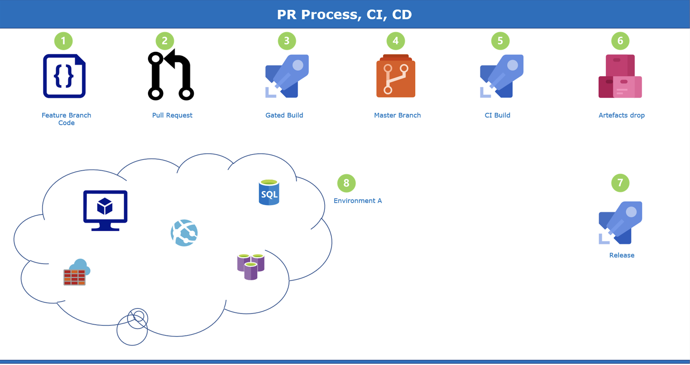
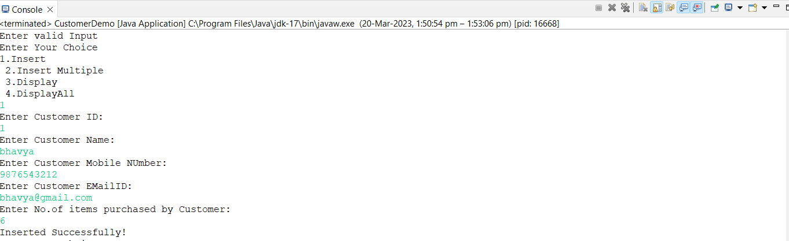
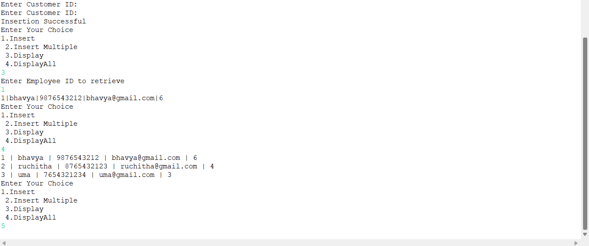

# Bhavya Dora - Linked List - Jdbc and Sql Operations

# Date Time:  11:30 am Wednesday, 22 March 2023 (IST)

## Java Training acquired

> 1. JAVA SWING: Subtle understanding of Swing components and functionalities and their role in creating customized and complex applications. Worked on basic applications such as Calculator, Basic Employee Management System etc., the inclusion of JDBC and OOPS concepts that makes it more custom-oriented and user interactive.
 
> 2. JAVA FX: Basic overview and brief understanding of JAVA FX and its use cases that can be implemented for creating applications. Worked on simple applications such as Calculator,Login Forms and To-do App where we can track attendance and add new employees and explored various components involved that make the portrayal of the application rich and interactive.
 
> 3. JAVA: Good understanding of OOPS concepts and JDBC.Currently, at a beginner’s level, but constantly working to build and sharpen my skills that can contribute to overall growth.

## Pull Request process, Continous Integration and Continous Delivery

**References:**
> 1.https://learn.microsoft.com/en-us/azure/devops/repos/git/about-pull-requests?view=azure-devops
> 2.https://learn.microsoft.com/en-us/azure/architecture/example-scenario/apps/devops-dotnet-baseline

## Linked List

> 1. A linked list is a linear data structure that stores a collection of data elements dynamically.
> 2. A linked list depicts that each node consists of two fields. The first field consists of data, and the second field consists of pointers that point to another node.

## Installation

> To use this SinglyLinkedList, you can follow the steps below:

> 1. Clone the repository. You can also download the zip file and extract it to your preferred directory.
> 2. Open the project in your favorite Java IDE (e.g. Eclipse, IntelliJ IDEA, NetBeans). Ensure that you have installed the necessary dependencies required for the project to run.
> 3. Run the Main file.

## Output

## MYSQL Work Bench

>  MySQL Workbench is a visual database design tool and administration tool for MySQL databases. It allows users to visually design, model, create and manage databases. MySQL Workbench provides a graphical user interface (GUI) to perform a variety of tasks such as creating, editing and deleting database objects, executing SQL queries, designing and generating data models, and managing database users and permissions.

*Installing MYSQL:*

> 1. Download the MySQL Installer from the official MySQL website: https://dev.mysql.com/downloads/installer/
> 2. Configure the MySQL Server, including the data directory, port number, authentication method, etc. 

## Connecting JDBC with MYSQL

> 1. Download the MySQL Connector/J JDBC driver from the official MySQL website: https://dev.mysql.com/downloads/connector/j/.
> 2. Add the path to the MySQL Connector/J JAR file to your classpath.

## JDBC CRUD Operations with MYSQL

> We have created CustomerDB database in MYSQL. We have created a single table called Customer with the following attributes:
ID, Name, Mobile, Email, ItemsPurchased. 

## Operations Performed:

> 1. Inserting
> 2. Inserting Multiple
> 3. Display
> 4. Display All

> I have used 2 functions for Insertion where in insert() is used to insert a single record and insertMultiple() is used to insert multiple records according to the user convenience.

> I have used 2 functions for Diplaying where in display() is used to display a single record and displayAll() is used to display multiple records according to the user convenience.

## Output

